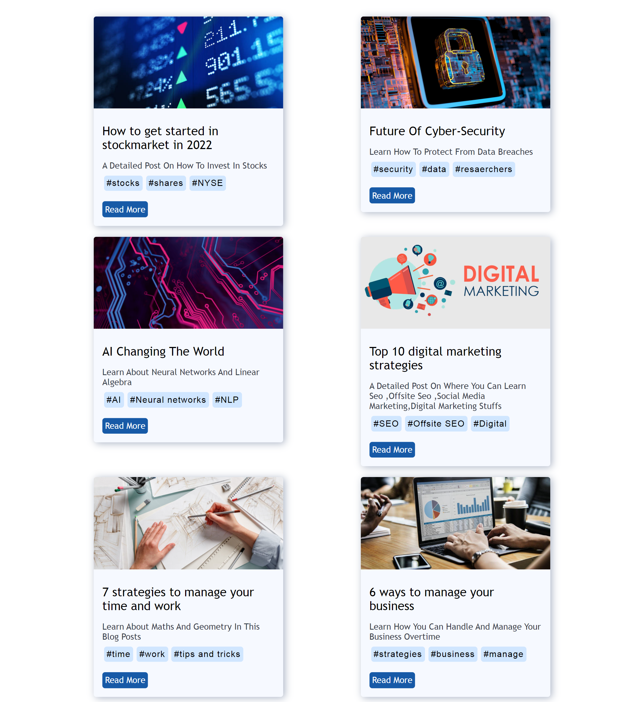
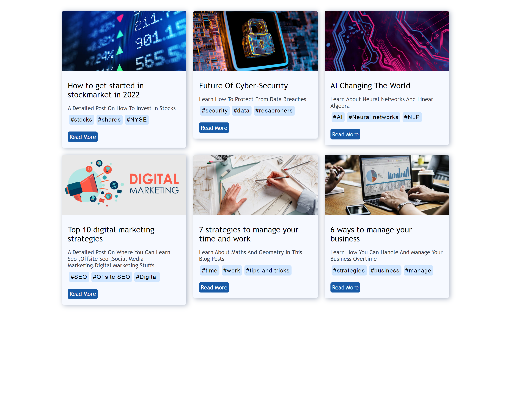

# Blog-Post-Card-Section-In-HTML-And-CSS
<h2>A Blog Post Card Section For Your Blog In HTML And CSS [ FLEXBOX ]!!!</h2>
 <h3> <li>Its Responsive, Cool Design With Hastags Options</li></h3>
<h3> I Also Have Youtube Video On This Go Check It Out : <a href ="https://youtu.be/hcZ_XBEBJKA">Here</a></h3>
<h2>Desktop Version:</h2>

  
<h2>Laptop Version:</h2>

  

  
<h2>Laptop Large Version:</h2>
  

  
<h2>Mobile Version:</h2>
  

